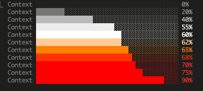
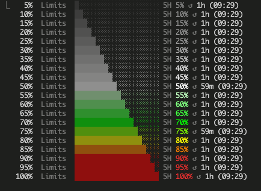
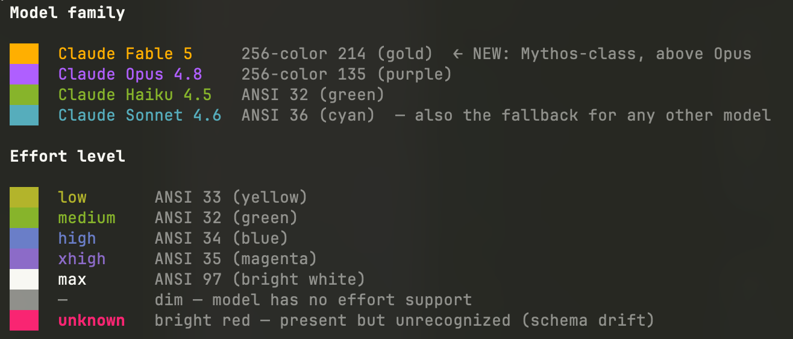

# claude-statusline

A custom 8-line colored statusline for [Claude Code](https://claude.com/claude-code). Drop-in Bash script — no build, no dependencies beyond `jq` and (optionally) `git`.

## What it looks like

Both previews below are plain text; in a real terminal every line is colored — dim labels, truecolor gradients on the context and rate-limit bars, distinct model and effort-level hues. See [`SPEC.md`](SPEC.md) for the full color spec.

**Baseline** — only the always-present fields:

<!-- preview:baseline -->
```
claude-statusline ⬠ main · +25 -7
Model   Claude Opus 4.8  xhigh · v2.1.195
Context ██████████░░░░░░░░░░░░░░░░░░░░ 35%
Tokens  In 1.2k · Out 800 · Cache 75%
Stats   Cost $0.12 · Dur 0m 42s
Limits  ████░░░░░░░░░░░░░░░░ 5H 22% ↺ 1h (10:00)
        █░░░░░░░░░░░░░░░░░░░ 7D 8% ↺ 1d (01/16 09:00)
abc12345-6789-defg-hijk-lmnopqrstuvw · 2026.01.15 09:00:00
```
<!-- /preview:baseline -->

**Everything on** — the same statusline with every optional / gated element present: account label (shown with a fictitious name), PR status, worktree, extended-thinking `✦`, CLI version, context-window size, compact count, the `⚠ 200k+` warning, API wait time, and the backup-drift flag. The dim label column also widens to fit the account name:

<!-- preview:full -->
```
Ada Lovelace claude-statusline ⬠ feat · +128 -34 · ✓ PR #42 · ⎇ wt@feat
Model        Claude Opus 4.8  xhigh ✦ · v2.1.195
Context      █████████████░░░░░░░░░░░░░░░░░ 45% · 1M · compact 2x
Tokens       ⚠ 200k+ · In 1.2k · Out 800 · Cache 75%
Stats        Cost $1.07 · Dur 22m 5s · API 10m 12s
Limits       ███████████████░░░░░ 5H 78% ↺ 2h (11:00)
             ███████░░░░░░░░░░░░░ 7D 35% ↺ 4d (01/19 09:00)
abc12345-6789-defg-hijk-lmnopqrstuvw · 2026.01.15 09:00:00 · ⚠ 3 files / 1d behind
```
<!-- /preview:full -->

_Both previews are generated by [`docs/preview.sh`](docs/preview.sh) — it renders the real `statusline.sh` against fixed sample payloads in a sandbox and rewrites the blocks above, so they never drift from the renderer._

The context bar is a smooth truecolor gradient — darkest gray at 0%, white at 60%, red from 70% on, with a white-to-yellow-to-red transition in between:



The 5h / 7d limit bars use a similar gradient but with later waypoints (white at 50%, pure green at 70%, pure yellow at 80%, pure red at 90%), so they stay grayscale during normal headroom and only light up as you approach your quota:



Model family and effort level are color-coded independently — Fable (the Mythos-class tier above Opus) is gold, Opus is purple, Haiku is green, anything else (Sonnet etc.) falls back to cyan. Effort mirrors Claude Code's `/effort` picker palette: yellow / green / blue / magenta / bright-white for low / medium / high / xhigh / max — plus a dim `—` when the model has no effort support and a bright-red `unknown` for any value the picker stops emitting:



_The three color-reference graphics above are generated by [`docs/swatches.sh`](docs/swatches.sh) — run it in a truecolor terminal (`./docs/swatches.sh [model|context|limit]`) and screenshot the section._

## Features

- **Smooth truecolor context bar** — dark gray → white → yellow → red gradient. White at 60%, pure red at 70%+. Reads cooler during headroom, gets loud at the danger zone.
- **Separate 5h / 7d rate-limit bars** with a truecolor gradient (gray → white → green → yellow → red, saturating at 90%) and `↺` reset times.
- **Git line** up top: repo name, branch, `+N -N` diff counts.
- **Account attribution on the top line** — the display name of the account this session is actually authenticated as, so you can tell at a glance whose quota a session is spending. If you use more than one Claude account on the same machine (personal and work, say), this is the field that keeps them straight. A companion hook resolves it from the credential the session really uses, not from a shared config file that can name a stale account; if it cannot resolve one, it shows a yellow `?` instead of guessing. Shows the friendly display name, never your email.
- **PR status** on the git line when a pull request exists for the branch — `✓ / ✗ / ● / ○ PR #N`, colored by review state (approved / changes-requested / pending / draft).
- **Worktree indicator** during `--worktree` sessions — `⎇ <name>` (with `@<branch>` when the branch differs from the worktree name).
- **Extended-thinking marker** — a `✦` on the model line when the session has extended thinking enabled.
- **Claude Code version** — a dim `v<version>` on the model line, read from the session payload. It reflects the CLI process actually serving the session, so a continuous run shows a fixed version while a `--resume` after an upgrade shows the new one.
- **Context window size** (`1M` / `200k`) on the context line, so you can tell the model's window at a glance.
- **200k+ context warning** — a red `⚠ 200k+` at the head of the tokens line when the session's context window has crossed 200k tokens (Claude Code's `exceeds_200k_tokens` flag), flagging the larger-window regime before it surprises you.
- **API wait time** on the stats line — real time spent waiting on the API, separate from total elapsed duration.
- **Effort-level color matches Claude Code's `/effort` picker** (low=yellow, medium=green, high=blue, xhigh=magenta, max=bright white). Read live from the session input — a model with no effort support shows a dim `—`, and any value the picker stops emitting shows a bright-red `unknown` so the display never silently lies.
- **Compact counter** — a companion `PreCompact` hook tracks how many times `/compact` has fired this session; the renderer surfaces it as `compact Nx` on the context line.
- **Raw session id on the last line** — copy-pasteable into `claude --resume <id>` (Claude Code doesn't do prefix matching, so the full UUID is shown).
- **Optional backup drift indicator** — if a `~/.claude/system/backup/.drift-status` flag file exists (written by an external backup script of your own), its text is appended to the last line as `⚠ <text>`. Absent that file, nothing shows — so this is inert unless you opt in.

## Requirements

- `jq`
- `git` (optional; only used for the git info line)
- A terminal with 24-bit truecolor support — macOS Terminal.app ≥ 10.14, iTerm2, Alacritty, kitty, WezTerm, Ghostty, modern tmux, etc.

## Install

1. Clone this repo anywhere.
2. Symlink the scripts into `~/.claude/`:
   ```bash
   ln -s "$PWD/statusline.sh"                 ~/.claude/statusline.sh
   mkdir -p ~/.claude/hooks
   ln -s "$PWD/hooks/compact-monitor.sh"      ~/.claude/hooks/compact-monitor.sh
   ln -s "$PWD/hooks/account-monitor.sh"      ~/.claude/hooks/account-monitor.sh
   ```
3. Add to `~/.claude/settings.json`:
   ```json
   {
     "statusLine": {
       "type": "command",
       "command": "bash ~/.claude/statusline.sh"
     },
     "hooks": {
       "PreCompact": [
         {
           "matcher": ".*",
           "hooks": [
             { "type": "command", "command": "bash ~/.claude/hooks/compact-monitor.sh" }
           ]
         }
       ],
       "SessionStart": [
         {
           "matcher": ".*",
           "hooks": [
             { "type": "command", "command": "bash ~/.claude/hooks/account-monitor.sh" }
           ]
         }
       ],
       "UserPromptSubmit": [
         {
           "hooks": [
             { "type": "command", "command": "bash ~/.claude/hooks/account-monitor.sh" }
           ]
         }
       ]
     }
   }
   ```
4. Restart Claude Code or wait for the next statusline refresh.

Both hooks are optional, and each one drives exactly one field. `PreCompact` drives the `compact Nx` counter; without it the counter stays at 0. `SessionStart` plus `UserPromptSubmit` drive the account label; without them the top line simply has no account label. Everything else works either way.

What the account hook does: it reads the credential your session authenticates with (from the environment, or the macOS Keychain, or `~/.claude/.credentials.json`), asks the API which account owns it, and caches the answer keyed by that credential. So it makes one network call per credential, not per prompt, and it never has to trust a name written by some other Claude Code window. It prints nothing and does its work in the background, so it does not slow a prompt down.

## Testing

Pipe a sample JSON payload through the script to preview output without going through Claude Code:

```bash
echo '{"model":{"display_name":"Claude Opus 4.7"},"session_id":"abc","cost":{"total_cost_usd":0.12,"total_duration_ms":42000},"context_window":{"used_percentage":35,"total_input_tokens":1200,"total_output_tokens":800,"current_usage":{"cache_read_input_tokens":900,"cache_creation_input_tokens":300}},"rate_limits":{"five_hour":{"used_percentage":22,"resets_at":'"$(($(date +%s)+3600))"'},"seven_day":{"used_percentage":8,"resets_at":'"$(($(date +%s)+86400))"'}},"workspace":{"current_dir":"'"$PWD"'"}}' | ./statusline.sh
```

## Spec

See [`SPEC.md`](SPEC.md) for the authoritative layout, color formulas, IPC invariants, and JSON contract.

## License

MIT — see [`LICENSE`](LICENSE).
